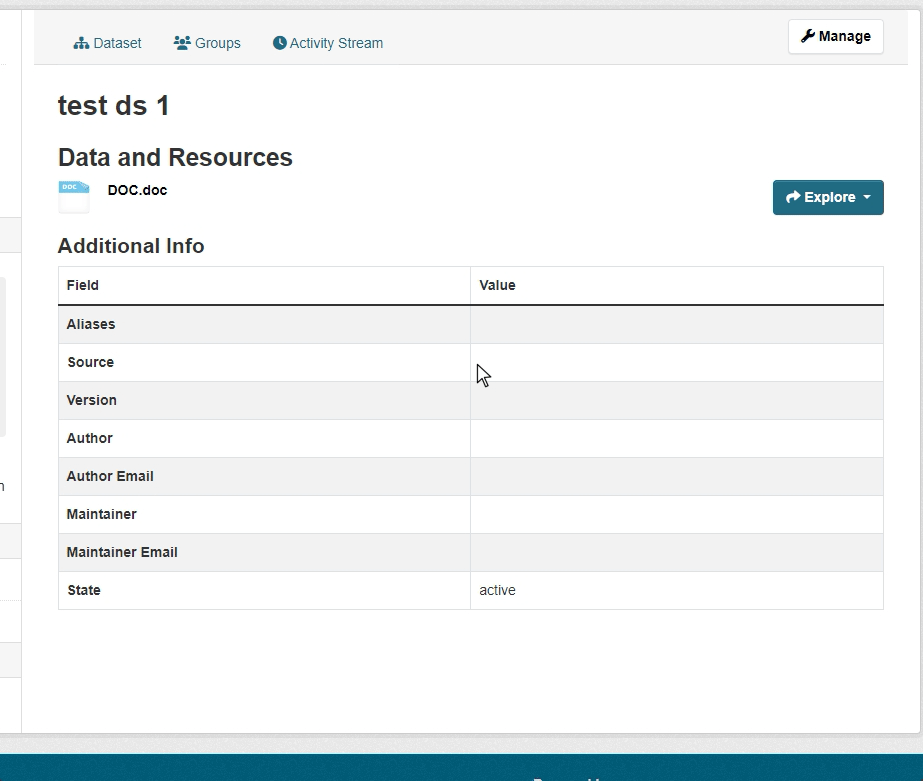
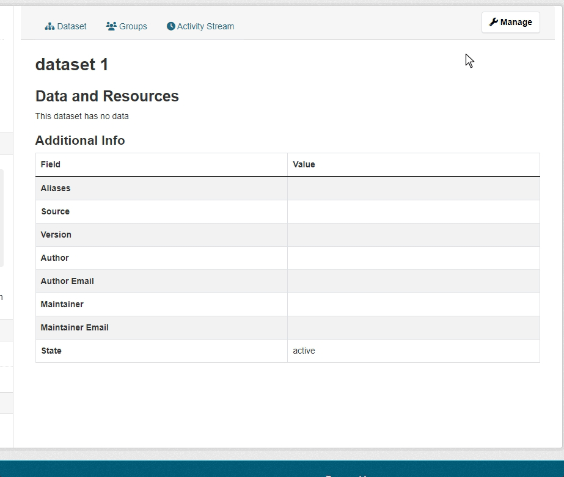

[](https://github.com/mutantsan/ckanext-alias/actions)

The extension allow you to create a URL aliases for datasets. For example, if you have a dataset with `my-dataset` name, it can be accessed via URL like that `https://your-domain/dataset/my-dataset`. Now you could add multiple aliases  that will redirect user to the dataset.

Creating and managing aliases is easy. There are two ways to create an alias.
1. An alias could be created automatically, if the `ckanext.alias.autosave_alias` config option in enabled. (_see [Config settings section](#config-settings) below_)
    
    The automatic creation will be triggered only if the new `name` differs from the previous one.
2. An alias could be created manually via dataset create/edit form.
    

## Requirements

The extension has only been tested with CKAN `2.10.1` and will most likely not work with versions below `2.10`.
Also, the extension relies on `ckanext-scheming` to add an `alias` field into schema. It won't work without scheming.

## Installation

1. Use `pip` to install an extension:  `pip install ckanext-alias`
2. Add `alias` to the `ckan.plugins` setting in your CKAN config file.

### Add an `alias` field to schema
The extension requires

## Config settings

The extension provides several configuration options to customize it.

```
# Specify a list of dataset types that is going to support aliases. Each specified dataset type schema
# must contain an alias field, otherwise, the extension isn't going to work (optional, default: dataset).
ckanext.alias.dataset_types = dataset project
```
```
# Specify an alias field name in dataset schema. The extension won't work, if the schema
# doesn't contain a specified field (optional, default: alias).
ckanext.alias.alias_fieldname = pkg_alias
```
```
# Specify whether a new alias will be created automatically on dataset update.
# If the name differs from the previous one, the alias will be created (optional, default: false).
ckanext.alias.autosave_alias = true
```
## Developer installation

To install ckanext-alias for development, activate your CKAN virtualenv and do:

    git clone https://github.com/mutantsan/ckanext-alias.git
    cd ckanext-alias
    python setup.py develop
    pip install -r dev-requirements.txt

## Tests

To run the tests, do:

    pytest --ckan-ini=test.ini


## License

[AGPL](https://www.gnu.org/licenses/agpl-3.0.en.html)
